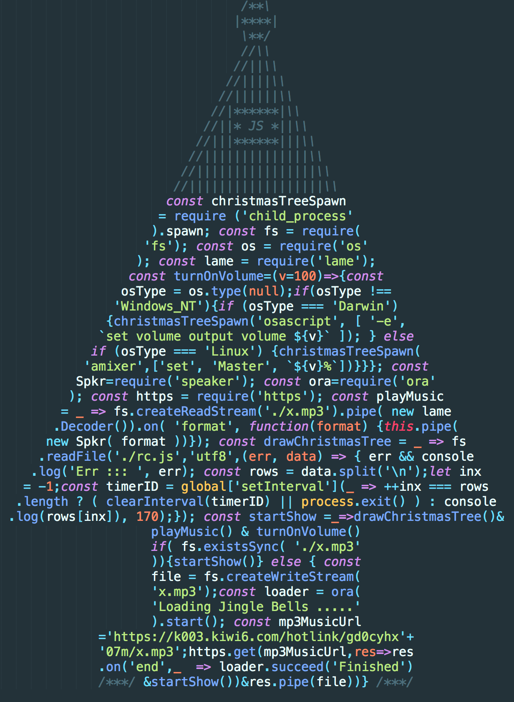

## Christmas Tree

### Introduction

This simple javascript file, the source of which looks like "Christmas Tree", during execution does the following steps.

1) Checks the x.mp3 file's existence in the source directory.
  - If it exists.
      * Skips to step 4
  - else
      * Executes step 2
2) Downloads the Jingle Bells Remix.
3) Saves it as x.mp3.
4) Checks the operating system.
5) Turns the volume of your machine up to 100%.
6) Plays Jingle Bells.
7) Code reads and draws itself line by line.

### Install

$ git clone https://github.com/surenat93/christmas-tree.git

$ npm i

### Usage

$ node rc.js

## License

MIT
